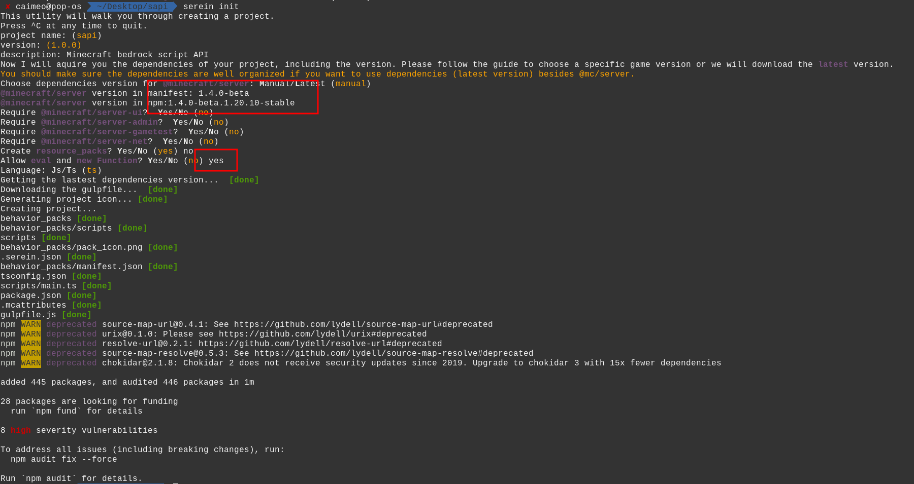
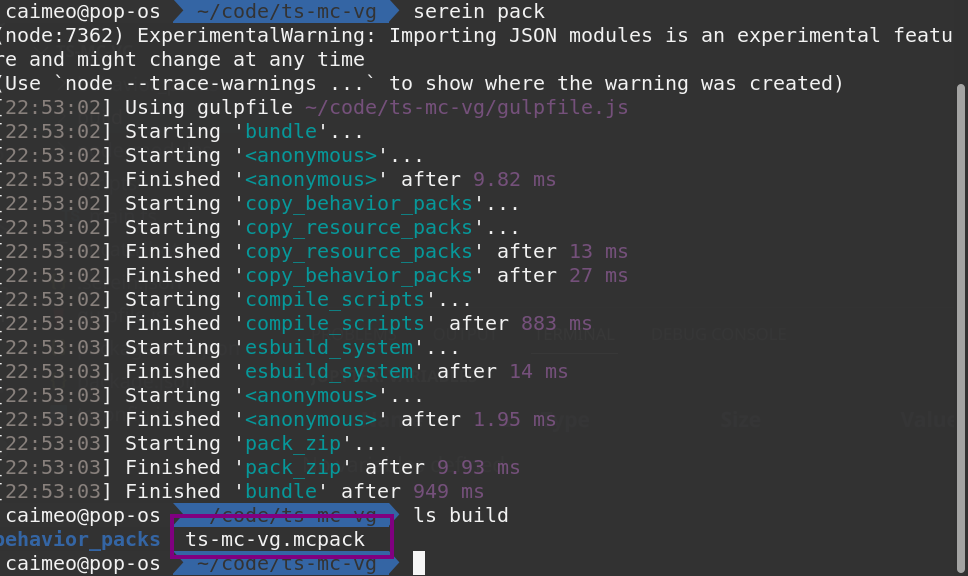
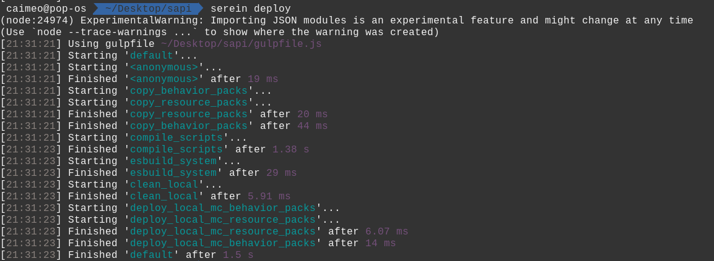
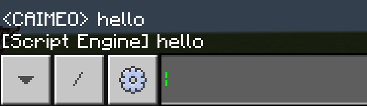

# 从Script API开始的函数式编程：写一个简单的体素几何库

## 前言

​	**Script API** 是Minecarft Bedrock的一个API，最早是开发者用来测试游戏内容的（也有**Gametest**这个名字）。而后来Mojang为它加入了很多方便的游戏事件和方法，使得Gametest具备了编写模组的能力（正式成为Script API）。而国内相关资料较少（或者过时），以Typescript为语言的资料更是稀缺，希望本篇文章能够填补一些空缺。除了 Script API 之外，本文还会渗透一些函数式编程、体素几何的思想。

### 先决条件

- 编程语言：本文面向具有一定**JavaScript**基础的读者，学习过**TypeScript**则更好（若没学过，你可以把**TypeScript**当成具有**类型标记**的**JavaScript**）。
- 行为包：读者最好有一定的Minecraft行为包基础知识，本文不会介绍行为包的结构。
- 开发环境：推荐使用
  - 操作系统：**Linux** (安装**Mcpelauncher**，这也是笔者使用的环境) / **Windows**（安装**Minecraft Windows 10**）
  
    >考虑到很多开发者都在 Android 平台进行开发，我推荐使用 Termux + SpaceVIM环境。但最好还是使用PC。
  - 游戏版本：Minecraft Bedrock **1.19.51**
  - 编辑器：**Visual Studio Code**
  - 包管理工具：NodeJS NPM
  - 项目管理：**Serein** （下文会告诉你安装方式）

## 准备工作

### 下载Serein

​	Serein 是一个为 Minecraft Bedrock Edition Script API 开发的脚手架项目，可以帮助开发者高效、优雅地创建和管理项目。利用它可以帮助我们快速构建项目并自动部署，很方便进行测试。

​	打开 **cmd** 或者 **Linux Terminal**， 输入以下命令来安装 serein 并初始化我们的项目：

```shell
npm i @pureeval/serein -g
mkdir ts-mc-vg && cd ts-mc-vg
serein init
```

​	按照流程配置项目（注意框选部分）：

​	之后在**Visual Studio Code**中打开 **ts-mc-vg** 文件夹，开始编写我们的程序。

### 项目结构

```shell
# behavior_packs文件夹是存放行为包信息地方
├── behavior_packs
│   ├── manifest.json
│   ├── pack_icon.png
│   └── scripts
├── gulpfile.js
├── package.json
├── package-lock.json

# scripts 文件夹存储 scripts文件
├── scripts
│   └── main.ts
└── tsconfig.json
```

- serein 利用 **gulp** 来完成自动部署和打包功能，因此 **gulpfile** 是必须的（你也可以根据自己的实际需求修改）
- main.ts 是脚本入口，之后它会被编译成 js 文件

### 使用Serein管理项目

​	Serein 提供了许多方便的函数供打包、测试使用。下面介绍几个常见的命令。

#### pack

​	自动打包项目，保存到 `build/` 目录下



#### deploy

​	自动部署到游戏路径（Development），会根据不同平台自动处理（包括Linux/Android/Windows）



### 测试流程

​	先写一段简单的代码来熟悉一下 serein的工作流。

​	这段代码的作用是复读玩家的话，不懂里面用到的函数没关系，后文会解释：

```typescript
// main.ts
import { world, BeforeChatEvent } from "@minecraft/server";
const overworld = world.getDimension("overworld");

function onChat(e: BeforeChatEvent) {
    overworld.runCommandAsync(`say ${e.message}`)
}

world.events.beforeChat.subscribe(onChat);
```

​	接下来运行deploy自动部署行为包：

```typescript
serein deploy
```

​	接下来可以开始测试了。

1. 打开Minecraft，创建一个新的世界

2. 选择创造模式

3. 添加你的行为包

   

4. 打开实验功能（**Beta APIs experiment**）

5. 进入世界

​	在聊天界面发送 `hello`，不出意外的话，会看到如下输出：

```
[Script Engine] hello
```



​	其它测试技巧：

1. 可以在设置打开调试控制台，便于查看错误信息
2. 执行 `serein watch`，gulp会监控代码修改，并自动部署到游戏中
3. 可在在游戏中使用 `/reload` 命令重新加载行为包

## Gametest框架简介

### 事件

​	事件系统，简单来说就是通过**监听**事件状态的变化，并在发生变化时做出相应的动作。在Minecraft中世界中发生的各种事件（如实体死亡、方块破坏、聊天信息等）都包含在了 `world.events` 中，你可以通过 `subscribe` 方法来设置事件的回调函数。完整事件列表可以查阅官方文档：

> https://learn.microsoft.com/en-us/minecraft/creator/scriptapi/

​	举个例子，我们可以监听 `BeforeChatEvent`， 这个事件会在玩家尝试发送聊天信息的时候调用。

```typescript
import { world, BeforeChatEvent } from "@minecraft/server";

// Kill sender named lampese
function onChat(e: BeforeChatEvent) {
  if (e.sender.name === 'lampese') {
    e.sender.kill();
  }
}

world.events.beforeChat.subscribe(onChat);
```

​	对于不熟悉ts的读者，`e: BeforeChatEvent `正是一个类型标注，格式是 `var: Type` 此处用到了参数 `e` 的 `sender: Player` 属性，随后调用了 `kill() `方法杀死玩家。

### 动作

​	事件系统使我们得以监听 Minecraft世界的信息，但目前我们还不能影响世界，为了达到这个目的，我们需要 `World` 和 `Dimension` 类（不过你并不能构造它们，只能通过 Script API 提供的函数获取），`@minecraft/server` 包中包含了 `world` 对象，你可以通过它提供的方法来访问世界的一些属性，比如玩家 （**getAllPlayers**） ，维度（**getDimension**） 等。

​	此处要重点介绍的是 `Dimension`，它同样也是无法构造的，只能通过 `getDimension` 方法获取。一般的（至少在本文如此），我们只需要获取主世界（overworld）。

```typescript
const overworld = world.getDimension("overworld");
```

​	`Dimension` 提供了更多修改世界的方法，加入 `getBlock` 是本文的主题。


​	关于其他函数的使用方法可以查阅官方文档：

> https://learn.microsoft.com/en-us/minecraft/creator/scriptapi/minecraft/server/minecraft-server

### 副作用

​	在本文，我们将一切能够影响Minecraft的函数称为具有**副作用（Side effect）**的函数，而无法对世界产生影响的函数称为**纯函数（Pure function）**。（注：此处对纯函数的定义不同于函数式编程中的，函数式编程纯函数限制更多一些）。

​	函数式编程的核心思想之一，就是尽可能地分离具有副作用的函数，组合多个纯函数以构造新的函数。

​	这么做的好处有很多，除了简化Debug流程外，Script API本身的特性也是一个重要因素。

​	Script API正处于成长期，这意味着它的API在不断更新，在社区里我见到过不少因为API更迭而不得不花费大量时间修改脚本的开发者，而如果分离了，那么我们只需要修改一小部分具有副作用的函数。

​	我们尽量使用纯函数，只在必要时使用非纯函数。

## 体素几何

### 体素是什么？

​	**体素（Voxel）**，是体**积像素（Volume Pixel）**的简称。类似二维空间的最小单位【像素】，体素是三维空间分割上的最小单位。我们可以给空间建立坐标系便于访问每个体素的坐标（正如我们在二维空间所做的事一样！）

​	Minecraft一切方块都有其坐标，显然也是个体素游戏，本文的标题【体素几何】就暗示了我们将在Minecraft世界中构造各种有趣的几何体（实际上并不止如此）。

### 坐标表示

​	在开始编写几何算法之前，我们先来搞清楚几个概念。

#### 空间和点

​	空间（Space）是一个数学概念，是指一种具有**特殊性质**及一些**额外结构**的**集合**，最常见的有拓扑空间、射影空间等。如果忽略方块类型，只考虑方块的有无，那么Minecraft世界可粗略看成一个 $\Z ^ 3$ 空间。我们在计算时采用在 向量空间 $\R ^ 3$ 上计算的策略，最后使用投影函数 $ P: \R^3 \to \Z^3$ 将几何体投射到世界中。

​	在计算机中表示一个空间的方式有很多，比如八叉树和数组。在此我们使用数组（因为这样很容易编写 $P$ ）表示空间。在此之前，我们可以先定义空间中的点（利用笛卡尔坐标系）：

```typescript
class Point {
  x: number;
  y: number;
  z: number;

  constructor(x: number, y: number, z: number) {
    this.x = x;
    this.y = y;
    this.z = z;
  }

  add(v: Point) {
    return new Point(this.x + v.x, this.y + v.y, this.z + v.z)
  }
}

type Space = Point[]
```

​	然后定义投影函数，此处只是简单的坐标投射（实际上，你还可以定义其他类型的投影函数，取决于需求）：
$$
\newcommand{\round}[1]{\lfloor#1\rceil}
\newcommand{\R}[0]{\mathbb{R}}
\newcommand{\Z}[0]{\mathbb{Z}}

P: (x,y,z) \mapsto (\round{x},\round{y},\round{z})
$$
​	其中 $\round x$表示四舍五入。在实际使用时，我们更需要一个定好的原点，好让空间投射到合适的位置。所以投射函数应该是这样的（其中 $P_0$ 表示原点，整个结构会以此为原点构建）：
$$
P': (x_0,y_0,z_0) \mapsto (x,y,z) \mapsto (\round{x_0+x},\round{y_0+y},\round{z_0+z})
$$
用ts代码表示就是（因为Minecraft会自动 `round`，所以我们不需要多写取整函数）：

```typescript
import { Vector3, MinecraftBlockTypes, BlockLocation } from "@minecraft/server";

// projection (Effect)
function projection(space: Space, origin: Point) {
    space.forEach((pos) => {
        const v = pos.add(origin)
        overworld.getBlock(new BlockLocation(v.x, v.y, v.z))
            .setType(MinecraftBlockTypes.ironBlock);
    });
}
```

- `dimension.getBlock` 可以获得某个位置的方块对象，参数是 `BlockLocation`
- `setType` 可以改变方块类型，此处写死为 **ironBlock**

### 简单几何

​	我们知道，三维空间 $\R^3$ 中的**球（Sphere）**可以定义为如下集合：
$$
S_r = \{P\in \R^3,d(P, P_0) \leq r \}
$$
​	其中 $d:\R^3 \times \R^3 \to \R$ 为度量函数，可以简单理解为空间两点之间的距离。$P_0$ 代表原点，而 $r$ 就是球的半径，一个常数。

​	$\R^3 $ 可以配备很多类型的度量函数，而一般的**欧几里得距离（Euclidean distance）**可定义如下：
$$
d_{3}((x_{1},y_{1},z_{1}),(x_{2},y_{2},z_{2}))=\sqrt {(x_{2}-x_{1})^{2}+(y_{2}-y_{1})^{2} + (z_2-z_1)^2}
$$
​	将其中一点固定为原点，我们用ts代码实现这个度量函数：

```typescript
const metrix_origin = ({x,y,z}:Point) => Math.sqrt(x * x + y * y + z * z);
```

​	接下来可以写出球的定义：

```typescript
const R_3: Space;
const sphere = (r: number) => R_3.filter((P) => metrix_origin(P) <= r);
```

​	看起来不错，但是这里的 `R_3` 如何定义？数学中的 $ \R^3 $ 显然是个无限（且不可数的）的集合，不可能在计算机的世界里表达（有些语言，如Haskell，可以使用惰性求值的策略来处理无限数据结构，不过这并不是Js擅长的）。所以我们需要一些技巧来构造 `R_3`。

​	展开球的数学表达式可以得到：
$$
x^2+y^2+z^2\leq r^2
$$
​	注意到：
$$
x^2\geq 0 \land y^2\geq 0 \land z^2\geq 0
$$
​	则必有：
$$
x^2\leq r^2 \implies x \in [-r,r] = I_r
$$
​	同理可得：
$$
y,z \in I_r
$$
​	最后：
$$
P \in I_r \times I_r \times I_r = I_r^3
$$
​	因此我们只需要遍历 $ \R^3 $ 子空间 $I_r^3$ 即可。问题在于，这还是一个无限大的空间，我们的处境并没有改变嘛！别忘了，我们最终只会把空间投射到 $\Z^3$ ，因此很多实数坐标都是不必计算的，我们只需要考虑整数坐标就行了。因此我们再取个子空间，记为 $ V_r $：
$$
V_r = \{ (x,y,z) \in I_r^3|x,y,z\in\Z \}
$$
​	关系链是：
$$
V_r \subset I^3_r \subset R^3
$$
​	到此，$V_r$ 是一个有限空间（实际上它有 $(2r+1)^3$ 个点），我们就可以遍历它了。

​	由于子空间 $ V_r$ 的构造依赖参数 $r$， 我们不妨构造一个函数 $V : \R \to V_r$ 来帮助我们构造这个子空间：

```typescript
const V: (r: number) => Space;
```

​	接下来我们写一个辅助函数帮助我们构造区间：

```typescript
type Interval = number[]
const range = (a: number, b: number, step : number = 1): Interval => Array.from({ length: (b - a) / step + 1}, (_, i) => a + (i * step))
```

​	注意到 $I_r^3 = I_r \times I_r \times I_r$ 是笛卡尔积，我们可以先写一个（通用）笛卡尔积的函数：

```typescript
// 类型标记过于复杂，用@ts-ignore偷懒好了
// @ts-ignore
const cartesian = (...a) => a.reduce((a, b) => a.flatMap(d => b.map(e => [d, e].flat())));
```


​	由于是通用的笛卡尔积，所以它的返回值是 `number[][]` ，需要将其转换为 `Space`：

```typescript
const fromList = (cp: number[][]): Space => cp.map(([x, y, z]) => new Point(x, y, z))
```

​	现在我们就可以写出函数 $V$ 的定义了：

 ```typescript
 const V = (r: number): Space => fromList(cartesian(range(-r, r), range(-r, r), range(-r, r)))
 ```

​	最后我们可以写出 `sphere` 的定义，非常简单。

```typescript
const sphere = (r: number) => V(r).filter(P => metrix_origin(P) <= r);
```

### 组合的力量

​	读者或许注意到了，我使用了非常多的辅助函数，这么做有什么好处，直接写个循环不是更快吗？其实这是一种**函数式编程**的思维，从中学阶段我们就学习过函数的概念，而函数的组合是非常强大的工具，这能够复用很多代码。比如我现在要写一个 `round` 函数来画一个垂直于 $y$ 轴的圆，这非常简单，只需要组合一下上面的函数：

```typescript
const V2 = (r: number): Space => fromList(cartesian(range(-r,r),[0],range(-r,r)))
const round = (r: number) => V2(r).filter(P => metrix_origin(P) <= r);
```

​	太棒了！一个绘制圆的函数。

​	那如果我要绘制椭圆面呢？在高中我们就学过椭圆的标准方程：
$$
\frac{x^2}{a^2} + \frac{y^2}{b^2} = 1
$$
​	要获得椭圆面，只需要修改等式为不等式：
$$
\frac{x^2}{a^2} + \frac{y^2}{b^2} \leq 1
$$
​	给出一个点，我们可以写出判断它是否在椭圆面上的代码（此处以垂直 $y$ 轴的椭圆为例）：

```typescript
const inEllipse = ({x,y,z}: Point, a: number, b: number) => x * x / (a * a) + z * z / (b * b) <= 1
```

​	我们之前写的 `filter` 参数也是一个判断点是否位于球、圆上的函数：

```typescript
const inSphere = (P:Point,r:number) => metrix_origin(P) <= r
```

​	并且椭圆的参数显然满足：
$$
x\in[-a,a]\land y\in [-b,b]
$$
​	那么椭圆的遍历空间 $V_{a,b}$ 定义也就明确了，此处数学定义留作习题。我们直接写出它的计算机定义：

```typescript
const V3 = (a: number, b: number) => fromList(cartesian(range(-a, a), [0], range(-b, b)));
```

​	最后我们写出构造椭圆面的函数：

```typescript
const ellipse = (a: number, b: number) => V3(a, b).filter(P => inEllipse(P,a,b));
```

### 再抽象一点？

> Programming is an abstraction of process, we judge when and how.
>
> <p align="right">--- Lampese</p>

​	函数复用非常优雅，我们可以轻而易举地定义很多不同的几何函数，只需要知道它的方程。不过，这并不是终点，读者应该注意到了，我们的程序还有很多相似之处，为什么不再进一步抽象呢？


​	我们再观察对比一下这几个定义：

```typescript
const sphere = (r: number) => V(r).filter(P => inSphere(P,r));
const round = (r: number) => V2(r).filter(P => inSphere(P,r));
const ellipse = (a: number, b: number) => V3(a, b).filter(P => inEllipse(P,a,b));
```

​	不难注意到这些几何结构都是由一个有限的空间，利用过滤器（filter）去除了不在某个结构上的点所得到的。所以我们可以写出如下函数。

```typescript
type Cond = (P:Point) => boolean
const gen = (S: Space, Exp: Cond) => S.filter(Exp)
```

​	这个 `Exp: Cond` 很有意思，但别忘了

```typescript
inSphere: (P: Point, r: number) => boolean
```

​	还有一个参数 `r`，这可不妙，而且 `inEllipse` 函数甚至还有两个参数。和 `Exp` 的类型签名不相符。这种情况该如何处理？

​	以 `inEllipse`为例，先看看我们能做点什么。

```typescript
inEllipse: (P:Point, a: number, b: number) => Space
```

​	如果我们想要调用这个函数，就必须传递三个参数，假设你现在只有两个参数 `a,b`，传入函数应该发生什么？

```typescript
inEllipse(undefined,a,b) => ?
```

​	对于原本的函数定义肯定会报错，因为第一个参数是 `undefined`。想象一下，如果真的只应用两个参数，这个函数应该返回什么才合理？一个合理的考虑就是返回一个接受 `P:Point` 单参数的函数，我们修改一下 `inEllipse`的定义：

```typescript
const inEllipse = (a: number, b: number) => (P: Point) => inEllipse(a,b,P)
```

​	看起来一切顺利，我们可以通过如下方式调用它：

```typescript
const partial_inEllipse = inEllipse(a, b);
partial_inEllipse(P);
```

### 偏函数

​	偏函数（Partial Function）是指一部分参数被固定的函数，调用这个偏函数只需要传入原函数没有固定的参数。上文的 `partial_inEllipse` 就是一个偏函数（它的名字就暗示了这一点）。

​	接下来我们修改 `inSphere` 函数：

```typescript
const inSphere = (r: number) => (P: Point) => metrix_origin(P) <= r
```

​	我们构造的偏函数都具有 `(P:Point) => boolean` 的签名，这下我们可以利用 `gen` 了！

```typescript
const sphere = (r: number) => gen(V(r), inSphere(r));
const round = (r: number) => gen(V2(r), inSphere(r));
const ellipse = (a: number, b: number) => gen(V3(a, b),inEllipse(a,b));
```

​	现在简洁地有点过分了。

### 通用构造

​	抽象似乎已经达到极限了，我们还能进一步扩展我们的程序吗？


​	答案是有，别忘了我们的核心是体素几何，如果只支持圆、球、椭圆，那限制也太大了。在初中我们就学过，在笛卡尔坐标系中，一个包含 $x,y,z$ 的方程、不等式可以表示一个结构，比如上文的球：
$$
x^2+y^2+z^2\leq r^2
$$
​	还有椭圆面的扩展，椭球：
$$
\frac{x^2}{a^2} + \frac{y^2}{b^2} + \frac{z^2}{c^2} \leq 1
$$
​	曲线的数量太多了，我们不可能考虑无限的情况，我们希望用户可以根据自己的需求，输入一个表达式，然后获得一个曲面，也就是我们期望编写一个这样的函数：

```typescript
generate: (exp: string, space: Space) => Space
```

​	其中 `exp` 是方程/不等式，而 `space` 是原空间，返回的空间一定是原空间的子空间，不可比原来的空间更大（要求这个参数是因为我们需要一个计算范围，你也知道计算机不可能穷举 $\R ^3$ 中的全部点）

​	先看 `exp` 参数，如果我们能够得到一个 `Cond` 类型的函数，那就可以调用 `gen` 方法了，我们先假设存在这么一个方法（先不考虑它的实际定义）：

```typescript
getCond: (expr: string) => Cond
```

​	此时 `generate` 的定义就明确了：

```typescript
generate = (exp: string, space: Space) => gen(space,getCond(exp))
```

​	但是 `getCond` 函数怎么办？并不困难，我们只需要利用 `new Function` 来定义函数：

```typescript
getCond = (expr: string): Cond => ({x,y,z}:Point) => (new Function("x","y","z", `return ${expr}`))(x,y,z);
```

​	还有一个问题，`space` 参数对用户并不友好，我们最好提供一些简单的函数辅助读者构造 `Space`，比如构造一个箱空间（Box），这是最常见的类型。上文定义的 `V` 正可以帮助我们完成此事：

```typescript
const generate_boxed = (exp: string, r: number) => generate(exp, V(r))
```

​	前面的 `sphere , round` 等函数也可以生成空间，都能够作为 `generate` 的参数。

#### 例子

- 椭圆抛物面（ $a=5,\ b=3$ ）
```typescript
generate_boxed("x * x / (5 * 5) + y * y / (3 * 3) == z", 10)
```
- 支持参数的双曲抛物面：

```typescript
const Hparaboloid = (a: number, b: number, r: number) => generate_boxed(`x * x / (${a * a}) - z * z / (${b * b}) == y`, r)
```

### 缩放投射

​	我在文章开头就指出，我们处于 $\R ^3$ 的空间中，不过到目前为止似乎都在和 $\Z ^3$ 打交道，因为投射到Minecraft世界中的坐标只能是整数。到目前为止是这样的，不过我们可能会见到一些**特别**的结构，它们通常比较小（或者说比较精细），比如单位球，如果直接投射那么它肯定都会堆在原点附近的几个方块，看不出哪有什么球的结构。此时可以使用简单的**缩放函数**把空间坐标成比例放大（ $t$ 为比例系数）：
$$
\begin{array}{cc}
S:\R^3 \times \R \to \R^3
\\
S: (x,y,z,t) \mapsto (tx,ty,tz)
\end{array}
$$

```typescript
const scale = (t: number) => (space: Space) => space.map(({ x, y, z }) => new Point(x * t, y * t, z * t))	
```

### 参数方程

​	普通方程可以代表绝大多数的几何结构，不过我们还没到终点。


​	有些常见的复杂结构，如扭结、莫比乌斯带和克莱因瓶等，却难以写出其普通方程（或者没有办法写出来、没有参考资料）。此时我们便要借助**参数方程（Parametric equation）**来描述这些几何结构。

​	参数方程就是利用一个或多个**参数**来描述一组**变量**的函数组合，通常可以用于表示复杂曲面和曲线等。举个例子，我们在高中就学过圆的参数方程：
$$
(x,y) = (\cos(t), \sin(t))
$$
​	$t \in (0,2\pi]$ 是参数。

​	熟悉三角换元的读者可能还知道如何写出椭圆的参数方程：
$$
(x,y) = (a\cos(t), b\sin(t))
$$
​	如果你学过微分几何，或许还见过表示**流形（Manifolds）**的参数方程，更典型的例子还有代数簇，不过这并不在本文的讨论范围之内。

​	现在我们只考虑如何构造 $\R ^3 $ 中的参数方程：
$$
(x,y,z) = (f(a_1,a_2,\cdots, a_n),g(a_1,a_2,\cdots, a_n),h(a_1,a_2,\cdots, a_n))
$$
​	最先考虑到的事情应该是，每个参数都应该有自己的名字和区间，但别忘记我们依然无法表示无限区间，所以需要步长。

```typescript
type Pm = [name: string, a: number, b: number, s: number]
```

​	三个坐标分量都有表达式，所以我们的函数签名应该是：

```typescript
parametric: (exp1: string, exp2: string, exp3: string, ...p: Pm[]) => Space
```

​	和 `getCond` 函数相似，我们也可以构造一个 `genFunc` 用来构造分量函数：

```typescript
const genFunc = (exp: string, args: string[]) => new Function(...args, `return ${exp}`)
```

​	先写两个辅助函数从 `Pm[]` 类型中提取参数名和对应的区间：

```typescript
const getArgs = (p: Pm[]) => p.map(v => v[0]);
const getIntervals = (p: Pm[]) => p.map(v => range(v[1], v[2], v[3]));
```

​	接着构造三个分量函数：

```typescript
const vars: string[] = getArgs(p);
const ranges: Interval[] = getIntervals(p);
const [xM, yM, zM] = [genFunc(exp1, vars), genFunc(exp2, vars), genFunc(exp3, vars)];
```

​	最后利用笛卡尔积组合区间，完成！

```typescript
return cartesian(...ranges).map((H: Interval) => new Point(xM(...H), yM(...H), zM(...H))).filter((v: any) => v);
```

​	写在一起就是：

```typescript
const genSpace = (exp1: string, exp2: string, exp3: string, ...p: Pm[]) => {
  const vars: string[] = getArgs(p);
  const ranges: Interval[] = getIntervals(p);
  const [xM, yM, zM] = [genFunc(exp1, vars), genFunc(exp2, vars), genFunc(exp3, vars)];
  return cartesian(...ranges).map((H: Interval) => new Point(xM(...H), yM(...H), zM(...H))).filter((v: any) => v);
}
```

## 命令解析

​	到目前为止，我们已经设计好了各种函数，现在应该考虑与Minecraft的交互设计，此处我们需要用到非纯函数了。实现很简单，只需要一个简单的命令解析器。、

​	我们采用如下约定的命令格式（和很多FP语言相似）：

```haskell
func var1 var2 ...
```

​	举个例子：

```haskell
ellipse 10 20
```

​	我们希望把它"翻译"为：

```typescript
projection(ellipse(10,20))
```

​	一个很简单的方式是先把可用的函数存进 `Map`， 根据用户的输入读取：

```typescript
const geo: { [key: string]: any } = {
    'sphere': sphere,
    'round': round,
    'ellipse': ellipse,
    'generate' : generate_boxed,
    'set': set_origin
}
```

​	注意到此处定义了一个 `set` 方法，它用于定义结构生成的原点。

```typescript
// origin 是一个可变变量
let origin = new Point(0, 0, 0)
const set_origin = (x: number, y: number, z: number) => origin = new Point(x, y, z)
```

​	现在编写函数主体：

```typescript
const run = (cmd: string) => {
    const cmds = cmd.split(' ')
    if (Object.keys(geo).includes(cmds[0])) {
        const space: Space = geo[cmds.shift()!](...to_para(cmds));
        projection(space, origin)
    }
}
```

​	这里需要一个函数把用户的输入变成 js 数据，由于我们只有两种输入类型，所以 `to_para` 函数很容易写出( `geo` 没有写上我们的 `genSpace` 函数，因为它依靠一个数组作为输入，而我们此处只能处理字符串和数字，更多复杂的情况留作习题）：

```typescript
const to_para = (x: string[]) => x.map(x => !isNaN(parseFloat(x)) ? parseFloat(x) : x)
```

​	别忘了监听事件：

```typescript
world.events.beforeChat.subscribe(e => run(e.message));
```

​	完成了，一个简单的体素几何库！现在我们部署到 Minecraft 测试一下：

```shell
serein deploy
```

​	加载行为包，进入世界，在聊天窗口输入 `set 0 0 0` 设定原点，再输入 `round 20` 构造一个半径为 $20$ 的圆：


​	然后就可以看到效果了：


## 结语

​	花了两天多的时间，终于把本文写完了。不知不觉就写了6400多字（似乎门槛有点高），Script API的内容并不多，但是最重要的概念已经介绍了，剩下的内容也是大同小异，读者可以自己查阅文档了解更多API。本文的目的更多的是希望读者能领会到函数式编程和几何的魅力，能够写出更易维护的 Script API 库，以及使用 serein节省开发时间。

#### 一些有用的链接

- 笔者的体素几何库： https://github.com/caimeox/voxelgeometry
- Serein： https://github.com/LoveCouple/serein
- 官方Script API文档： https://learn.microsoft.com/en-us/minecraft/creator/scriptapi/

