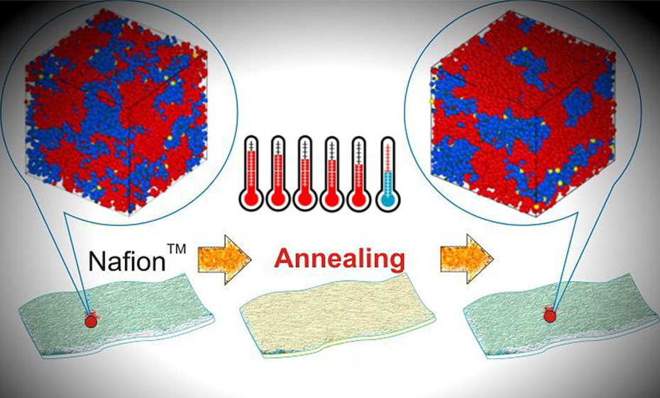
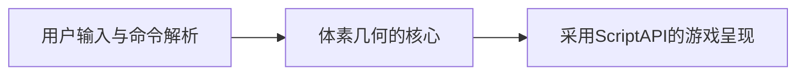
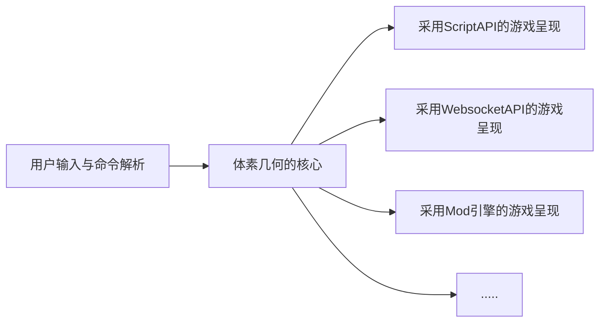

# 线性变换

### 为什么需要线性变换？

前几节我们曾经提到了空间类型 Space，可以设想一下你需要对这个空间做很多变换：离散、偏移、甚至是旋转。在以前实现这些需求的时候，你肯定会对每一个需求单独分析，比如将点离散的操作，通常的实现是这样的：

```typescript
function diffusion(points: Point[], factor: number): Vec3[] {
  return points.map((b) => new Vec3(b.x * factor, b.y * factor, b.z * factor));
}
```

这其实已经是非常优雅的实现方式了，他运用了 map 的方式来正确的表达需求，但是我们仍然需要对每个操作思考如何用具体的代码流程来概括，而不是用简单的运算来概括，这如果放在我们下文的线性变换中，我们可能只需要一个简单的运算来概括：

```typescript
function diffusion(points: Matrix, factor: number): Matrix {
  return points.mul([
      [factor, 0, 0],
      [0, factor, 0]
  ]);
}
```

### 线性变换的有力工具——矩阵与矩阵乘法

在数学上矩阵的一个**狭义**的定义是：矩阵是一个按照长方形排列的复数或实数集合。因为空间变换的实际需要，我们只研究实数矩阵的运算与性质。

下面是一个四行四列的矩阵（可简记为 $4\times 4$ 的矩阵）：
$$
\left[\begin{array}{c}
1 & 2 & 3 & 4 \\1 & 2 & 3 & 4 \\1 & 2 & 3 & 4 \\1 & 2 & 3 & 4 \\\end{array}\right]
$$
那么矩阵的运算是什么呢？

#### 矩阵的代数运算

矩阵的代数运算顾名思义就是矩阵与数字的运算，我们假设加减乘除为一个运算符 $\sigma$，那么定义 $\phi(a,b)=a\ \sigma\ b$，矩阵的代数运算就满足：
$$
\left[\begin{array}{c}1 & 2 & 3 & 4 \\1 & 2 & 3 & 4 \\1 & 2 & 3 & 4 \\1 & 2 & 3 & 4 \\\end{array}\right] \sigma \ x= \left[\begin{array}{c}\phi(1,x) & \phi(2,x) & \phi(3,x) & \phi(4,x) \\\phi(1,x) & \phi(2,x) & \phi(3,x) & \phi(4,x)\\\phi(1,x) & \phi(2,x) & \phi(3,x) & \phi(4,x) \\\phi(1,x) & \phi(2,x) & \phi(3,x) & \phi(4,x) \\\end{array}\right]
$$
一个更直观的例子比如矩阵的数乘运算($\sigma = \times, \phi(a,b)=a\times b$)：
$$
\left[\begin{array}{c}1 & 2 & 3 & 4 \\1 & 2 & 3 & 4 \\1 & 2 & 3 & 4 \\1 & 2 & 3 & 4 \\\end{array}\right] \times \ 10= \left[\begin{array}{c}10 & 20 & 30 & 40 \\10 & 20 & 30 & 40\\10 & 20 & 30 & 40 \\10 & 20 & 30 & 40 \\\end{array}\right]
$$
实际上如果上面的 $\phi$ 是一个**柯里化(curried)函数**，我们就可以在代码轻松的抽象这个运算：

````typescript
Matrix sigma x = Matrix.map(x => phi(x))
````

#### 矩阵的加法、乘法运算

矩阵的加法我们不再赘述，两个矩阵对位相加即可。

矩阵的乘法运算是针对矩阵和矩阵的运算，它的规则如下：

设 $A$ 为 $m\times p$ 的矩阵，$B$ 为 $p\times n$ 的矩阵，那么称 $m\times n$ 的矩阵 $C$ 为矩阵 $A$ 与矩阵 $B$ 的乘积，记作 $C=AB$，其中矩阵 $C$ 的第 $i$ 行第 $j$ 列元素可以表示为：
$$
(AB)_{ij}=\sum^p_{k=1}a_{kj}b_{kj}=a_{i1}b_{1j}+a_{i2}b_{2j}+...+a_{ip}b_{pj}
$$
公式可能有些隐涩难懂，读者可以写出两个矩阵手动模拟一下该过程，就可以清晰的理解矩阵乘法的流程。

### 在体素几何变换中的应用

读完前文的基本线性代数知识，读者很可能会想：这和高中阶段的向量的叉乘、点乘很相似！

是的，狭义的矩阵可以被认为是向量的高维抽象，而我们前面定义的 Point 正是一个标准的**矢量**。

那么如果我们把很多 Point 拼接成 Space(Point[]) (也就是最后的几何体)，就等同于很多三维矢量连接起来，成为一个 $3\times n$ 矩阵！

接下来我们就可以把一些针对矩阵的线性变换应用到几何体上：

#### move

move 操作指对于一整个 Space $S$ 给出一个偏移向量 $(x,y,z)$ ，对空间根据偏移量进行偏移。

采用矩阵我们可以轻易的概括该操作：
$$
move(S,Point\rightarrow (x,y,z))=S +\left[\begin{array}{c}x & y & z \\ .& .& .  \\x & y & z \\\end{array}\right]
$$

#### diffusion

diffusion 操作指对于一整个 Space 给出一个偏移向量 $(x,y,z)$ ，对空间根据偏移量进行散射。

采用矩阵我们可以轻易的概括该操作：
$$
diffusion(S,Point\rightarrow (x,y,z))=S\cdot \left[\begin{array}{c}x & y & z \\ .& .& .  \\x & y & z \\\end{array}\right]
$$

#### rotate

rotate 操作指对于一整个 Space 给出一个方向角 $\alpha$，对空间根据方向角旋转。

采用矩阵我们可以轻易的概括该操作：
$$
rotate(S,\alpha)=S\cdot \left[\begin{array}{c}\cos\alpha & 0 & \sin\alpha \\ 0& 1& 0  \\-\sin\alpha & 0 & \cos\alpha \\\end{array}\right]
$$
这就是线性代数在体素集合中参与线性变换的一些简单的例子，当然如果我们需要用代码来实现，需要预先准备一个底层抽象——**线性代数运算库**，笔者手动实现了一个可以满足自身需求的，读者也可以选用现有的很多优秀的开源库。
## Canvas

Canvas API(画布)是在 HTML5 中新增的标签用于在网页实时生成图像，并且可以操作图像内容，基本上它是一个可以用JavaScript操作的位图(bitmap)。

如果有我们在体素几何库中拥有了它，就代表我们可以迁移很多 Web 上自由绘制的矢量图！

很幸运的是目前有 Canvas 转为 Space 的库，笔者引进了它并写了一个简单的代码框UI，目前可以采用 canvas 代码来绘制图像：


## DLA (Diffusion Limited Aggression)

扩散限制凝聚 Diffusion-limited Aggregation(DLA)，是由 Witten 和 Sander 于 1978 年共同提出来的，其基本思想是：首先置一初始粒子作为种子，在远离种子的任意位置随机产生一个粒子使其做无规行走，直至与种子接触，成为集团的一部分；然后再随机产生一个粒子，重复上述过程，这样就可以得到足够大的 DLA 团簇(cluster)。


该算法经常被用于模拟科学实验和绘制图像，我们也可以来实现一个。

当然，这里可能显得**没有那么函数式**，因为 TypeScript 语言不借助第三方库还没有达到可以实现 DLA 算法的抽象程度。

我们首先考虑在二维空间上的 DLA 算法，重新定义一个二维空间上的 Point：

```typescript
class Point {
  x: number;
  y: number;
  stucked = false;
  constructor(x: number, y: number) {
    this.x = x;
    this.y = y;
  }
  private vary(steplength: number) {//将该点根据步长偏移到下一个为止
    return [this.x + rand() * steplength, this.y + rand() * steplength];
  }
  walk(width: number, steplength: number) {//根据步长和边界的长宽进行“行走”
    let [tox, toy] = this.Vary(steplength);
    while (Math.abs(tox) > width / 2 || Math.abs(toy) > width / 2) {
      [tox, toy] = this.vary(steplength);
    }
    [this.x, this.y] = [tox, toy];
  }
}
```

接下来我们要考虑一件事，如何判断两个种子接触？在实数定义上我们认为两个种子的距离足够近就是已经接触，在这里我们选择这样判断：

```typescript
function distance(a: Point, b: Point): number {
  return (a.x - b.x) * (a.x - b.x) + (a.y - b.y) * (a.y - b.y);
}

function checkStuck(a: Point, b: Point, step: number): boolean {
  return distance(a, b) < 1.8 * step;
}
```

如果是这样我们就可以进一步实现一个 **DLASystem**：

```typescript
class DLASystem {
  width: number;//边界的长度
  maxWalk: number;//最多正在行走的点
  iterations: number;//每次行走迭代的次数
  step: number;//行走的步长
  temperature: number;//系统的初始温度
  walkering: Point[];//正在行走的点
  stucked: Point[];//已经被困住加入系统的点
  summoner: (width: number) => number[];//点的随机生成器
    
  constructor(...) {
    ...
    this.stucked.push(new Point(0, 0));
    while (this.walkering.length < maxWalk) {
      this.walkering.push(toPoint(randPoint(this.width)));
    }
  }

  run(): Vec3[] {
    while (this.walkering.length) {
      for (let i = 1; i <= this.iterations; ++i) {
        for (let j = 0; j < this.Walkering.length; ++j) {
          if (this.walkering[j].stucked === true) continue;
          this.walkering[j].walk(this.width, 1);
          for (let k = 0; k < this.stucked.length; ++k) {
            if (checkStuck(this.walkering[j], this.stucked[k], this.step)) {
              this.walkering[j].stucked = true;
              this.stucked.push(this.walkering[j]);
              break;
            }
          }
        }
        this.walkering = this.walkering.filter((v) => v.stucked === false);
      }
      while (this.walkering.length < this.maxWalk && this.temperature > 1) {
        this.walkering.push(toPoint(randPoint(this.width)));
        this.temperature *= 0.995;
      }
    }
    return this.stucked;
  }
}

function randPoint(width: number): number[] {
  return [rand() * (width / 2), rand() * (width / 2)];
}
```

我们看到上面的代码中有一个 temperature 变量每次以 0.995 倍的速度在下降来控制整个系统是否要持续迭代，你可能会思考为什么我们不去直接写死循环次数而是用这种看起来很抽象的方式来迭代呢？

实际上我们可以思考这个算法的实质，我们如果引入了温度的概念，就可以把温**度作为一个参量**加入点的行走，温度越高运动越大，温度越低运动越小，一个全部都是随机点的系统，随着温度的突然上升和缓慢下降，就会逐渐趋近于**稳态**，这就是热力学上**金属退火的原理**，在随机化算法中多有使用。



而实际上我们也可以把 Point 拓展到三维，这些可以由读者自行思考。

## More

笔者在实现这些功能的同时实际上还做了更多工作：

- **LSystem** 一种可以模拟植物生长的算法，笔者根据论文实现了一个简单的系统。

- **Turtle Graphic** 我们熟悉的海龟画图，笔者也实现了一个简单的绘图系统。

- **Chaos Game/IFS** 笔者采用混沌游戏的方法实现了一个迭代函数系统。

实际上上面的三个工作并非不重要，反而可能比本文所讲述的基础更加精彩，但涉及的知识和论文太多，读者感兴趣的可以来笔者的存储库自行探索。


## 纯函数、核心分离、WebViewer

### 纯函数

前文已经讲到了**纯函数**和**副作用**，但是读者可能还是认为这些概念有些缥缈，到底为什么要如此强调他们呢？

首先，纯函数对于相同的参数一定有相同的结果，不受外界的干扰，这是数学定义上的函数。而如果不是这样，一个函数就**可能**有了副作用，因为它执行的结果是不确定且不安全的。

就像我们常说的 **IO(input/output)** 行为，你调用了多次 `input()` ，可能得到的是不同的键盘输入，也可能会因为键盘输入不合法而获得错误，因此 IO 行为并不是纯的。

类比到我们用 Script API 开发体素几何库，用户与控制台的交互是不确定的，我们根据用户的需求计算出的结果应用到游戏中得到的反馈也是不确定的，因此他们都不是纯的过程。

而我们的体素几何库实际上是一个全部都是纯函数的**黑盒**，它不需要处理用户输入的错误，也不需要处理输出时的错误，我们只关心这部分纯的过程，这样的思想和设计模式可以让我们更好的分离实现各部分代码，让代码耦合度大大降低。

通俗的来说就是比如我们要生成一个几何体，我们是先生成出完整的几何体，再交给有副作用的函数处理生成，而不是一边运算一边生成。

### 核心分离

上一节我们提到了体素几何库实际上是一个**黑盒**，他的运行原理是这样的：



但是我们的核心是**纯粹**的，我们完全可以不止局限于采用 Script API 来呈现，所以笔者把代码核心独立出去作为一个单独的 **npm package**(core)，游戏代码部分再采用 **esbuild** 来统一构架和应用 treeshake 生成代码，而我们的 Script API 就只剩下对**获取用户输入和几何体的生成**了。核心如果有更新只需要用 npm 来更新核心即可。

前文介绍的 Serein 脚手架支持用户从 npm 库中引用库并且一并打包到资源包内，这也是我们从这里得到的思路。


那么获取到核心之后我们就可以把他**推广到更多领域**，比如采用基岩版的 Websocket API，或者迁移到各种 Mod 引擎……



### WebViewer

我们已经分离了核心，目前可以再解决一个问题：**我每次测试都要去游戏里面测试，有没有什么办法可以更简单的测试？**

当然有！在 Web 中有 `three.js` 可以快速的解决这个问题，我们只需要编写一个支持预览方块和与用户交互的网页，然后接入我们的核心，就可以实时预览某条输入在游戏中的呈现效果！

**实际上，前文读者看到的浅蓝色背景，黑色石块的所有示意图都是我们采用自己写的 WebViewer 预览的，大大提高了我们的开发效率**。

刚才的流程图细化就是这样的：


笔者所作的大致的实现：


### More

实际上我们还做了更多，我们把核心发布到 npm 的同时，就可以写**自动发布**的 Github Action


或者说我们可以不止把 WebViewer 限制在本地运行，可以用 rollup 打包成**在线运行**的版本挂载到 Github Pages...

## 别玩抽象了，你能离谱点吗？

是的我们可以，为了更好的编写这个库、并且让用户编写的命令不用如此冗长，我们又开了一个叫 **PureEval** 的项目，用来实现有关 js/ts 函数式编程的**一切**。比如我们的参数方程就可以很轻松的被抽象：

```typescript
import { compose, iterate, map } from "PureEval";

const parametric = (
  x: number[],
  y: number[],
  z: number[],
  cost: (x: number, y: number, z: number) => number[]
): Point[] => compose(map(toPoint), iterate(cost, x, y, z));
```

更抽象？好的，我们用**函数式编程来处理命令解析的副作用**！

```javascript
//这里换回 JavaScript 了
import { Task, split, compose, pairList } from 'PureEval';
const run = Task((reject, resolve) => world.events.beforeChat.subscribe((e) => resolve(e)))
	.chain((data) =>
		Task(
			(reject, resolve) =>
				(v = trycatch(compose(pairList, split), data) ? resolve(v) : reject('Error'))
		)
	)
	.map((fun, ...args) => geo[fun](...args))
	.fold(console.error, projection(origin));
```

## 结语

我的能力有限，仅补充了一些内容到 10000 多字，感谢各位阅读文章，如果错误还望指出。